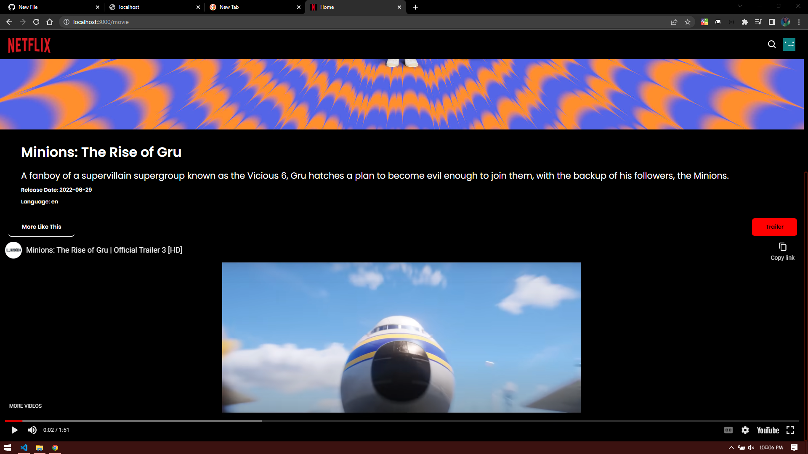

A fully functional netflix clone. I can confidently say you won't find a better clone out there.
Movies and series list pulled from moviedb apis.
Trailers for each movies connected to youtube.
similar watch, search bar and so much more.
written in reactJs.
It is connected to a mondoDb and nodejs backend for authentication.
Styles compoenets and a very "real" Ui.
demo app: https://netflix-sample.netlify.app/Home

